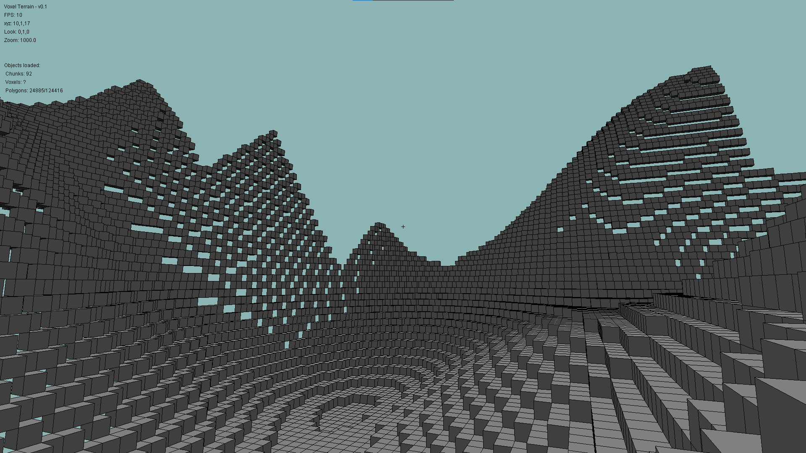

# Voxel-Engine

A 3D rendering engine built in Java without any dependencies. Implements a rasterization approach. Currently developing procedural terrain generation to accompany this to demonstrate its abilities.

[](https://github.com/edgorman/Voxel-Engine/actions/workflows/maven.yml)



## Installation
Use the following command to clone the repository:
```
cd your/repo/directory
git clone https://github.com/edgorman/Voxel-Engine
```

Must have a recent Java version, this repo uses [Java 15.0.2](https://www.oracle.com/uk/java/technologies/javase-jdk15-downloads.html).

Must also have a recent Maven version, this repo uses [Maven 3.6.3](https://maven.apache.org/download.cgi).

## Usage
Open a command prompt and run the following commands:
```
mvn package
```

Assuming no errors have been thrown, you can run the application:
```
java -cp target/voxel_engine-0.1.jar com.gorman.voxel_engine.Main
```

## Contributing
Pull requests are welcome. For major changes, please open an issue first to discuss what you would like to change.

## License
[MIT](https://choosealicense.com/licenses/mit/)
